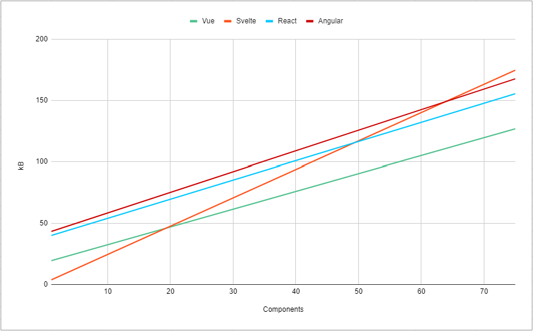

# Fork of vue-svelte-size-analysis

[Original repo](https://github.com/yyx990803/vue-svelte-size-analysis)

## Gaute's analysis & takeaways
Everything above is from the original repository [vue-svelte-size-analysis](https://github.com/yyx990803/vue-svelte-size-analysis).

From this point on I wanted to add my own comparisons with React and Angular in the mix, to compare three of the most popular frameworks.

|                 | Vue     | Svelte v4 | Svelte v5 | React   | Angular  | Solid  | Preact  |
| --------------- | ------- | --------- | --------- | ------- | -------- | ------ | ------- |
| Component chunk | 1.42kB  | 2.35kB    | 1.56kB    | 1.31kB  | 1.67kB   | 1.59kB | 1.27kB  |
| Vendor chunk    | 18.45kB | 1.80kB    | 6.34kB    | 38.79kB | 43.97kB  | 3.37kB | 6.37kB  |

Svelte is smallest from 0-19 components.  
Vue is smallest from 20 components.  
React is smaller than Svelte after 50 components.  
Angular is smaller than Svelte after 64 components.  

This was done on versions Vue 3.4.19, Svelte 4.2.12, React 18.2.0, Angular 17.2.2, Solid 1.8.15, and Preact 10.19.6. 
Note that in newer versions they can make improvements reducing the size or add features growing the size.